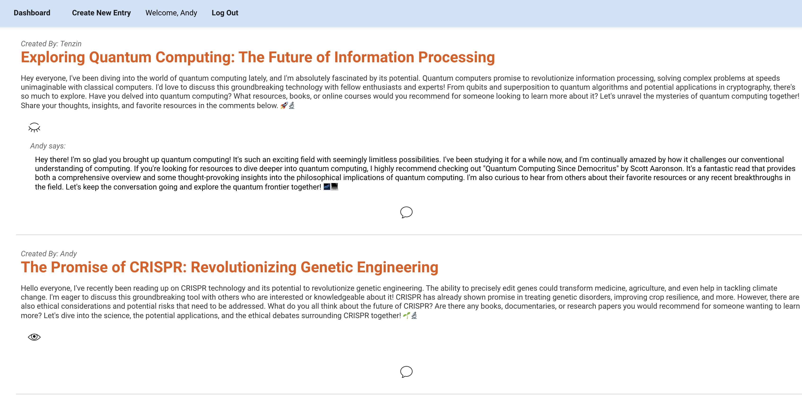

# INTERACTICA

This is a "Reddit" like MERN app, where users can post an idea or a question, and other users can comment it. Users can come everyday to see a NASA image of the day in the login or sign up form, which is obtained via an API.

# Technologies used

- React
- JavaScript
- Express
- Mongoose
- GitHub
- Heroku
- CSS

# Screenshots

# Getting started

- [Heroku](https://interactica-c5b46cef8de9.herokuapp.com/)
- [GitHub](https://github.com/lucy-rz/project-4)
- [Trello, ERD, Wireframe](https://trello.com/b/455SxS4C/the-dancing-penguins)

# Future steps

- Complete CRUD
